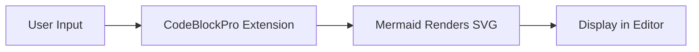
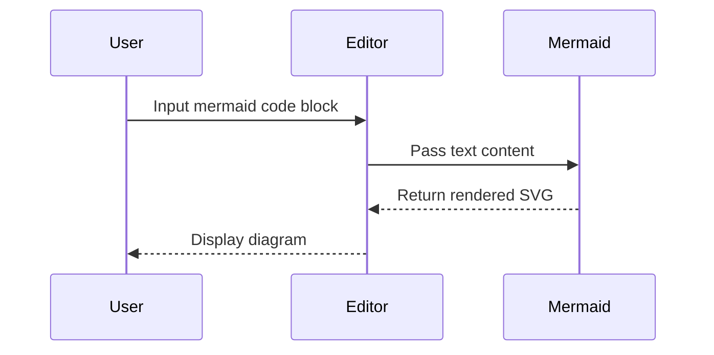

# @tiptap-codeless/extension-code-block-pro

Enhanced code block extension for Tiptap with macOS-style chrome, syntax highlighting, Mermaid diagrams, and rich UX.

- [English](README.md) (Current)
- [中文](README.zh.md)

---

## ✨ Features

- 🎯 **macOS-style header**: Classic three buttons (close, collapse, fullscreen)
- 🌓 **Light / Dark / Auto theme**: Follows system theme or forced light/dark
- 🔢 **Line numbers**: Toggleable, configurable start line
- 📁 **Code folding**: Collapse long blocks with “expand all” affordance
- 🎨 **Syntax highlighting**: Powered by `lowlight` (highlight.js ecosystem)
- 🌈 **Language switcher**: 20+ common languages with aliases
- 📋 **Copy to clipboard**: One-click copy with feedback state
- 📊 **Mermaid diagrams**: Optional Mermaid rendering for `mermaid` code blocks
- 🛠️ **Highly customizable**: Headers, toolbar, layout, attributes, CSS variables
- ♿ **Accessibility**: Keyboard friendly, semantic markup

---

## 📦 Installation

```bash
pnpm add @tiptap-codeless/extension-code-block-pro lowlight

# Optional, only if you need Mermaid diagram support
pnpm add mermaid
```

This package is **ESM-only** and targets modern React + bundler setups.

Styles are **automatically injected** by the extension, you don’t need to import any CSS manually.

---

## 🚀 Basic Usage

```tsx
import { useEditor, EditorContent } from '@tiptap/react';
import StarterKit from '@tiptap/starter-kit';
import { CodeBlockPro } from '@tiptap-codeless/extension-code-block-pro';
import { createLowlight } from 'lowlight';

// Import languages you actually need
import javascript from 'highlight.js/lib/languages/javascript';
import typescript from 'highlight.js/lib/languages/typescript';
import python from 'highlight.js/lib/languages/python';

// Create lowlight instance
const lowlight = createLowlight();
lowlight.register('javascript', javascript);
lowlight.register('typescript', typescript);
lowlight.register('python', python);

const editor = useEditor({
    extensions: [
        StarterKit.configure({
            codeBlock: false, // Disable built-in codeBlock if you want to replace it
        }),
        CodeBlockPro.configure({
            lowlight,
            defaultLanguage: 'javascript',
            theme: 'auto', // 'light' | 'dark' | 'auto'
        }),
    ],
});

function App() {
    return <EditorContent editor={editor} />;
}
```

---

## 📊 Mermaid Support (Optional)

`CodeBlockPro` can render **Mermaid diagrams** when:

- The code block language is set to `'mermaid'`
- You have `mermaid` installed in your app

```bash
pnpm add mermaid
```

The extension:

- Does **not** bundle `mermaid` itself (it's an optional peer dependency)
- Uses **dynamic import** so Mermaid code is only loaded when you actually render a Mermaid block and toggle the diagram view

### Mermaid Diagram Examples

Select `mermaid` as the language in the editor, then enter code like the following to switch to diagram view:



You can also use more complex syntax, such as sequence diagrams:



---

## ⚙️ Configuration Options

| Option                          | Type                          | Default                                                                             | Description                                                               |
| ------------------------------- | ----------------------------- | ----------------------------------------------------------------------------------- | ------------------------------------------------------------------------- |
| `lowlight`                      | `Lowlight`                    | `undefined`                                                                         | Lowlight instance for syntax highlighting                                 |
| `languages`                     | `LanguageConfig[]`            | `defaultLanguages`                                                                  | Available languages in the language selector                              |
| `defaultLanguage`               | `string \| null`              | `null`                                                                              | Default language for new code blocks                                      |
| `theme`                         | `'light' \| 'dark' \| 'auto'` | `'auto'`                                                                            | Theme mode                                                                |
| `macosControls`                 | `MacOSControlsConfig`         | `{ showClose: true, showCollapse: true, showFullscreen: true }`                     | macOS-style header controls configuration                                 |
| `macosControls.showClose`       | `boolean`                     | `true`                                                                              | Show close button                                                         |
| `macosControls.showCollapse`    | `boolean`                     | `true`                                                                              | Show collapse button                                                      |
| `macosControls.showFullscreen`  | `boolean`                     | `true`                                                                              | Show fullscreen button                                                    |
| `macosControls.onClose`         | `(node, pos) => void`         | `undefined`                                                                         | Close button click callback                                               |
| `macosControls.onFullscreen`    | `(node, pos) => void`         | `undefined`                                                                         | Fullscreen button click callback                                          |
| `toolbar`                       | `ToolbarConfig`               | `{ showLanguageSelector: true, showCopyButton: true, showLineNumbersToggle: true }` | Toolbar configuration                                                     |
| `toolbar.showLanguageSelector`  | `boolean`                     | `true`                                                                              | Show language selector                                                    |
| `toolbar.showCopyButton`        | `boolean`                     | `true`                                                                              | Show copy button                                                          |
| `toolbar.showLineNumbersToggle` | `boolean`                     | `true`                                                                              | Show line numbers toggle button                                           |
| `lineNumbers`                   | `LineNumbersConfig`           | `{ enabled: true, startLine: 1, toggleable: true }`                                 | Line numbers configuration                                                |
| `lineNumbers.enabled`           | `boolean`                     | `true`                                                                              | Enable line numbers by default                                            |
| `lineNumbers.startLine`         | `number`                      | `1`                                                                                 | Starting line number                                                      |
| `lineNumbers.toggleable`        | `boolean`                     | `true`                                                                              | Allow toggling line numbers                                               |
| `collapse`                      | `CollapseConfig`              | `{ enabled: true, defaultCollapsed: false, collapsedLines: 3 }`                     | Code folding configuration                                                |
| `collapse.enabled`              | `boolean`                     | `true`                                                                              | Enable code folding                                                       |
| `collapse.defaultCollapsed`     | `boolean`                     | `false`                                                                             | Default collapsed state                                                   |
| `collapse.collapsedLines`       | `number`                      | `3`                                                                                 | Number of lines to show when collapsed                                    |
| `lazyRender`                    | `LazyRenderConfig`            | `{ enabled: false, rootMargin: '100px', placeholderHeight: 100 }`                   | Lazy render configuration for performance with many code blocks           |
| `lazyRender.enabled`            | `boolean`                     | `false`                                                                             | Enable lazy render (only render when in viewport)                         |
| `lazyRender.rootMargin`         | `string`                      | `'100px'`                                                                           | IntersectionObserver root margin (e.g. start render 100px before visible) |
| `lazyRender.placeholderHeight`  | `number`                      | `100`                                                                               | Placeholder height (px) before content is rendered                        |
| `className`                     | `string`                      | `undefined`                                                                         | Custom CSS class name                                                     |
| `HTMLAttributes`                | `Record<string, any>`         | `{ class: 'code-block-pro' }`                                                       | Additional HTML attributes                                                |

---

## 💻 Commands

Once the extension is registered, you can use the following commands:

```ts
// Set a code block (with language)
editor.commands.setCodeBlock({ language: 'javascript' });

// Toggle between code block and paragraph
editor.commands.toggleCodeBlock({ language: 'typescript' });

// Update language of the current code block
editor.commands.updateCodeBlockLanguage('python');

// Toggle collapsed state of current code block
editor.commands.toggleCodeBlockCollapse();

// Toggle line numbers of current code block
editor.commands.toggleCodeBlockLineNumbers();
```

---

## 🎨 Theming

### Built-in Theme Switch

```ts
// Force light theme
CodeBlockPro.configure({ theme: 'light' });

// Force dark theme
CodeBlockPro.configure({ theme: 'dark' });

// Auto switch by system preference
CodeBlockPro.configure({ theme: 'auto' });
```

### Customizing via CSS Variables

All visual styles are driven by CSS variables, so you can override them in your own stylesheet:

```css
.code-block-pro-wrapper {
    --cbp-bg: #ffffff;
    --cbp-text: #24292e;
    --cbp-border: #d0d7de;
    --cbp-accent-color: #3b82f6;
    /* More variables can be found in src/styles/*.css */
}
```

You can also add different prefix classes (e.g., `theme-dark`) for more fine-grained control.

---

## ⚙️ Configuration Overview

All configuration options are typed via `CodeBlockProOptions`. Here's a quick example:

```ts
CodeBlockPro.configure({
    lowlight, // Required for syntax highlighting
    defaultLanguage: 'javascript',
    theme: 'auto',
    macosControls: {
        showClose: true,
        showCollapse: true,
        showFullscreen: true,
    },
    toolbar: {
        showLanguageSelector: true,
        showCopyButton: true,
        showLineNumbersToggle: true,
    },
    lineNumbers: {
        enabled: true,
        startLine: 1,
        toggleable: true,
    },
    collapse: {
        enabled: true,
        defaultCollapsed: false,
        collapsedLines: 3,
    },
    lazyRender: {
        enabled: false, // Enable for pages with many code blocks
        rootMargin: '100px',
        placeholderHeight: 100,
    },
});
```

---

## 📖 Examples

See the example project in `examples/code-block-pro` directory for a full integration with Tiptap and React.

---

## 📄 License

MIT © [namelesserlx](https://github.com/namelesserlx)
