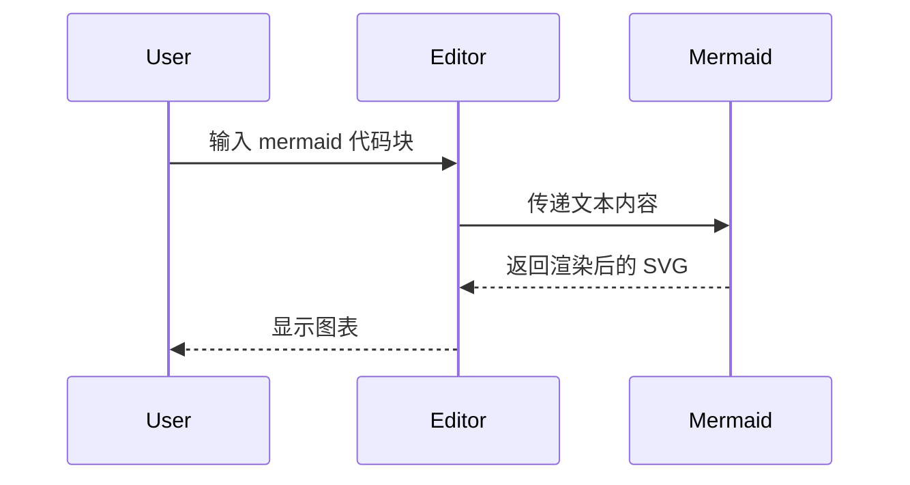

# @tiptap-codeless/extension-code-block-pro

增强版代码块扩展，为 Tiptap 提供 macOS 风格外观、语法高亮、Mermaid 图表和丰富的编辑体验。

- [English](README.md)
- [中文](README.zh-CN.md) (当前)

---

## ✨ 特性

- 🎯 **macOS 风格头部**：经典三按钮（关闭 / 折叠 / 全屏）
- 🌓 **明亮 / 暗黑 / 自动主题**：可跟随系统，也可强制指定
- 🔢 **行号显示**：支持起始行号和一键开关
- 📁 **代码折叠**：长代码块可折叠，带“展开全部”提示
- 🎨 **语法高亮**：基于 `lowlight`（highlight.js 生态）
- 🌈 **多语言切换**：内置多种常见语言及别名
- 📋 **一键复制**：内置复制按钮和复制状态反馈
- 📊 **Mermaid 图表**：可选的 Mermaid 渲染（仅在语言为 `mermaid` 时启用）
- 🛠️ **高度可定制**：丰富的配置、回调与 CSS 变量
- ♿ **无障碍**：键盘友好，语义化结构

---

## 📦 安装

```bash
pnpm add @tiptap-codeless/extension-code-block-pro lowlight

# 如果需要 Mermaid 图表支持（可选）
pnpm add mermaid
```

本包是 **ESM-only**，面向现代 React + 打包工具（Vite / webpack5 / Rspack / Next.js 13+ 等）。

样式会在扩展初始化时 **自动注入**，无需单独引入 CSS。

---

## 🚀 基本用法

```tsx
import { useEditor, EditorContent } from '@tiptap/react';
import StarterKit from '@tiptap/starter-kit';
import { CodeBlockPro } from '@tiptap-codeless/extension-code-block-pro';
import { createLowlight } from 'lowlight';

// 按需引入语法高亮语言
import javascript from 'highlight.js/lib/languages/javascript';
import typescript from 'highlight.js/lib/languages/typescript';
import python from 'highlight.js/lib/languages/python';

// 创建 lowlight 实例
const lowlight = createLowlight();
lowlight.register('javascript', javascript);
lowlight.register('typescript', typescript);
lowlight.register('python', python);

const editor = useEditor({
    extensions: [
        StarterKit.configure({
            codeBlock: false, // 如果想完全替换内置 codeBlock，建议关闭
        }),
        CodeBlockPro.configure({
            lowlight,
            defaultLanguage: 'javascript',
            theme: 'auto', // 'light' | 'dark' | 'auto'
        }),
    ],
});

function App() {
    return <EditorContent editor={editor} />;
}
```

---

## 📊 Mermaid 支持（可选）

`CodeBlockPro` 支持将语言为 `mermaid` 的代码块渲染为 **Mermaid 图表**：

- 你需要在业务项目中安装 `mermaid`
- 选择语言为 `mermaid`，并在工具栏中打开“图表模式”

```bash
pnpm add mermaid
```

扩展本身：

- **不会** 将 `mermaid` 打包进库中（作为可选 peerDependency）
- 使用 **动态导入**，只有在你真正渲染 Mermaid 代码块并打开图表时才加载对应代码

### Mermaid 图表示例

在编辑器中选择语言为 `mermaid`，然后输入类似下面的代码，即可切换到图表视图进行预览：


你也可以使用更复杂的语法，例如时序图：



---

## ⚙️ 配置选项

| 选项                            | 类型                          | 默认值                                                                              | 描述                                               |
| ------------------------------- | ----------------------------- | ----------------------------------------------------------------------------------- | -------------------------------------------------- |
| `lowlight`                      | `Lowlight`                    | `undefined`                                                                         | 语法高亮实例（必填）                               |
| `languages`                     | `LanguageConfig[]`            | `defaultLanguages`                                                                  | 语言选择器中的可用语言列表                         |
| `defaultLanguage`               | `string \| null`              | `null`                                                                              | 新建代码块的默认语言                               |
| `theme`                         | `'light' \| 'dark' \| 'auto'` | `'auto'`                                                                            | 主题模式                                           |
| `windowControls`                | `WindowControlsConfig`        | `{ close: true, collapse: true, fullscreen: true }`                                 | macOS 风格头部控制按钮配置                         |
| `windowControls.close`          | `boolean`                     | `true`                                                                              | 显示关闭按钮                                       |
| `windowControls.collapse`       | `boolean`                     | `true`                                                                              | 显示折叠按钮                                       |
| `windowControls.fullscreen`     | `boolean`                     | `true`                                                                              | 显示全屏按钮                                       |
| `windowControls.onClose`        | `(node, pos) => void`         | `undefined`                                                                         | 关闭按钮点击回调                                   |
| `windowControls.onFullscreen`   | `(node, pos) => void`         | `undefined`                                                                         | 全屏按钮点击回调                                   |
| `toolbar`                       | `ToolbarConfig`               | `{ language: true, copy: true, lineNumbers: true }`                                 | 工具栏配置                                         |
| `toolbar.language`              | `boolean`                     | `true`                                                                              | 显示语言选择器                                     |
| `toolbar.copy`                  | `boolean`                     | `true`                                                                              | 显示复制按钮                                       |
| `toolbar.lineNumbers`           | `boolean`                     | `true`                                                                              | 显示行号切换按钮                                   |
| `lineNumbers`                   | `LineNumbersConfig`           | `{ enabled: true, start: 1, allowToggle: true }`                                    | 行号配置                                           |
| `lineNumbers.enabled`           | `boolean`                     | `true`                                                                              | 默认显示行号                                       |
| `lineNumbers.start`             | `number`                      | `1`                                                                                 | 起始行号                                           |
| `lineNumbers.allowToggle`       | `boolean`                     | `true`                                                                              | 允许切换行号显示                                   |
| `collapse`                      | `CollapseConfig`              | `{ enabled: true, defaultCollapsed: false, visibleLines: 3 }`                       | 代码折叠配置                                       |
| `collapse.enabled`              | `boolean`                     | `true`                                                                              | 启用代码折叠                                       |
| `collapse.defaultCollapsed`     | `boolean`                     | `false`                                                                             | 默认折叠状态                                       |
| `collapse.visibleLines`         | `number`                      | `3`                                                                                 | 折叠时显示的行数                                   |
| `rendering`                     | `RenderingConfig`             | `{ lazy: false, rootMargin: '100px', placeholderHeight: 100 }`                      | 渲染性能配置                                       |
| `rendering.lazy`                | `boolean`                     | `false`                                                                             | 是否启用延迟渲染（仅进入视口时渲染）               |
| `rendering.rootMargin`          | `string`                      | `'100px'`                                                                           | IntersectionObserver 边距（如提前 100px 开始渲染） |
| `rendering.placeholderHeight`   | `number`                      | `100`                                                                               | 占位符高度（px），内容未渲染前显示                 |
| `HTMLAttributes`                | `Record<string, any>`         | `{ class: 'code-block-pro' }`                                                       | 额外的 HTML 属性                                   |

---

## 🔒 只读模式

`CodeBlockPro` 跟随 Tiptap 编辑器级别的只读状态，不需要在扩展里额外配置 `readonly` 选项。

```tsx
const editor = useEditor({
    editable: false,
    extensions: [
        StarterKit.configure({ codeBlock: false }),
        CodeBlockPro.configure({ lowlight }),
    ],
});

// 运行时切换
editor?.setEditable(false);
editor?.setEditable(true);
```

编辑器处于只读状态时：

- 禁止会修改文档的行为：编辑代码内容、切换语言、删除代码块、会写入节点属性的命令都会 no-op / 返回 `false`。
- 保留纯查看行为：复制、全屏、折叠/展开、行号显示切换、Mermaid 代码/图表预览切换仍可使用。
- 只读下的查看切换只影响当前 UI 状态，不会写回文档 JSON。

---

## 💻 可用命令

注册扩展后，你可以使用以下命令：

```ts
// 设置代码块（并切换语言）
editor.commands.setCodeBlock({ language: 'javascript' });

// 在段落 / 代码块之间切换
editor.commands.toggleCodeBlock({ language: 'typescript' });

// 更新当前代码块语言
editor.commands.updateCodeBlockLanguage('python');

// 切换当前代码块折叠状态
editor.commands.toggleCodeBlockCollapse();

// 切换当前代码块行号显示
editor.commands.toggleCodeBlockLineNumbers();
```

---

## 🎨 主题与样式定制

### 内置主题切换

```ts
// 强制明亮
CodeBlockPro.configure({ theme: 'light' });

// 强制暗黑
CodeBlockPro.configure({ theme: 'dark' });

// 跟随系统
CodeBlockPro.configure({ theme: 'auto' });
```

### 通过 CSS 变量定制

组件样式大量依赖 CSS 变量，你可以在全局样式中覆盖：

```css
.code-block-pro-wrapper {
    --cbp-bg: #ffffff;
    --cbp-text: #24292e;
    --cbp-border: #d0d7de;
    --cbp-accent-color: #3b82f6;
    --cbp-font-mono:
        ui-monospace, 'SFMono-Regular', 'SF Mono', 'Cascadia Mono', 'Segoe UI Mono',
        'Liberation Mono', Menlo, Monaco, Consolas, 'Courier New', monospace;
    /* 更多变量可以在 src/styles/*.css 中查看 */
}
```

默认情况下，CodeBlock Pro 会对外层容器和代码内容统一使用同一套系统等宽字体栈，这符合常见编辑器的最佳实践，也避免了核心包额外内置字体资源。如果你的业务需要更强的一致性，可以在宿主项目样式里覆盖 `--cbp-font-mono`。

也可以根据主题添加不同前缀类（例如 `theme-dark`）做更精细的控制。

---

## ⚙️ 配置总览

所有配置选项均由 `CodeBlockProOptions` 类型约束。以下是一个快速示例：

```ts
CodeBlockPro.configure({
    lowlight, // 语法高亮实例（必填）
    defaultLanguage: 'javascript',
    theme: 'auto',
    windowControls: {
        close: true,
        collapse: true,
        fullscreen: true,
    },
    toolbar: {
        language: true,
        copy: true,
        lineNumbers: true,
    },
    lineNumbers: {
        enabled: true,
        start: 1,
        allowToggle: true,
    },
    collapse: {
        enabled: true,
        defaultCollapsed: false,
        visibleLines: 3,
    },
    rendering: {
        lazy: false, // 代码块较多时启用可优化性能
        rootMargin: '100px',
        placeholderHeight: 100,
    },
});
```

---

## 📖 示例

你可以在仓库中的 `examples/code-block-pro` 目录查看完整示例（包含 React + Tiptap 集成）。

---

## 📄 许可证

MIT © [namelesserlx](https://github.com/namelesserlx)
